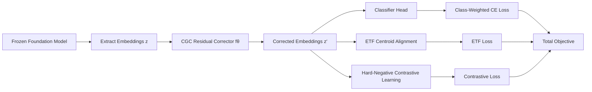
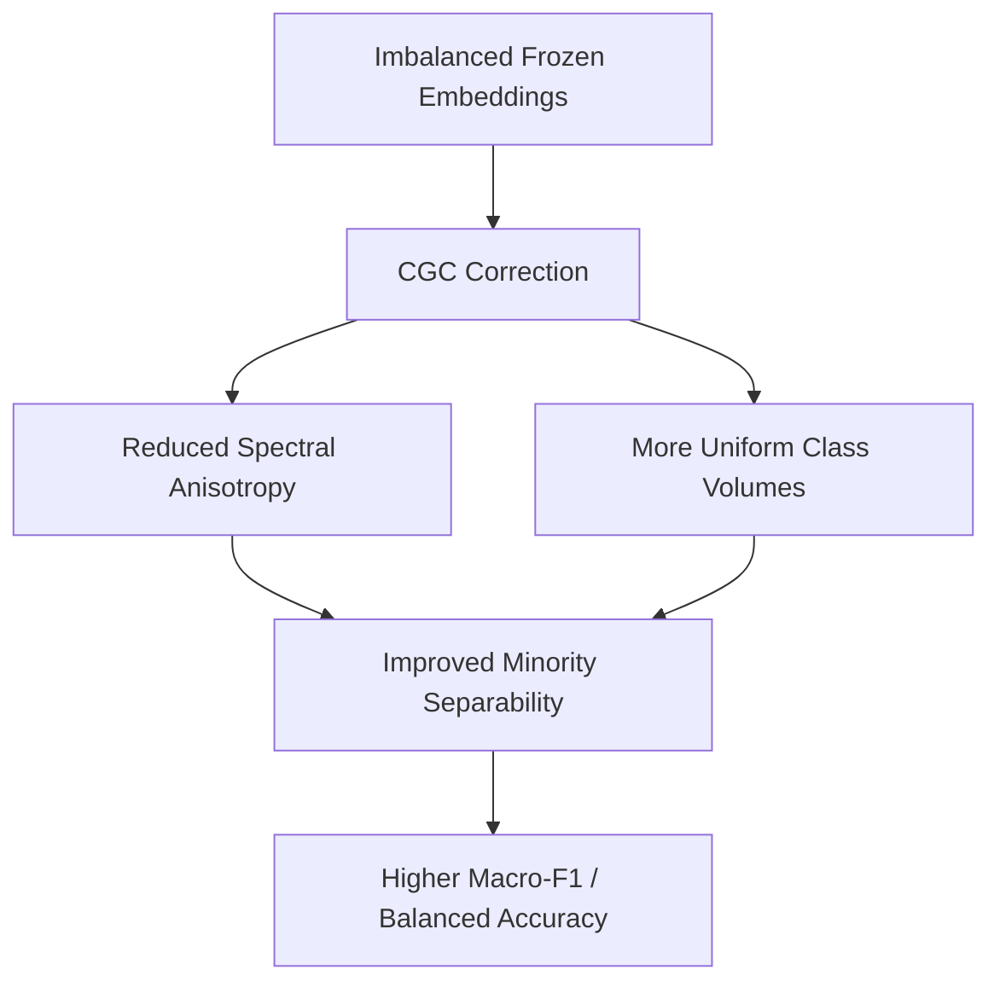

# CGC: Cluster Geometry Correction for Embedding-Ready SAR Ship Classification with Frozen Foundation Models

## Overview

This repository accompanies the paper on **Cluster Geometry Correction (CGC)**, a lightweight post-hoc module designed to improve imbalanced SAR ship classification using **frozen** foundation-model embeddings.

CGC corrects two geometric pathologies commonly observed in frozen embeddings under long-tail imbalance:

- **Spectral anisotropy** (variance concentrated in a few principal directions)
- **Unequal cluster volumes** (class tightness coupled to class frequency)

---

## Abstract

Frozen SAR foundation model embeddings, when applied to imbalanced ship classification, are susceptible to two characteristic pathologies: spectral anisotropy (variance concentrated in a few principal directions) and unequal cluster volumes, both of which undermine sensitivity to minority classes.  
We introduce **CGC (Cluster Geometry Correction)**, a deep learning-based, post-hoc residual module that refines embedding geometry through ETF centroid alignment and hard-negative contrastive learning, without retraining or adapting the foundation model.  
Evaluated on two SAR foundation models and two benchmark datasets (OpenSARShip and FUSARShip), CGC consistently improves macro-F1 and balanced accuracy over the frozen baseline. Gains on FUSARShip reach up to **+8.1 pp macro-F1** and **+6.4 pp balanced accuracy**, with strongest improvements on minority and low-frequency classes.  
Geometric diagnostics confirm that CGC reduces spectral anisotropy and equalises cluster dispersion, demonstrating that post-hoc correction of frozen representations can address structural embedding pathologies in high-imbalance SAR recognition.

---

## Contributions

1. Characterize two geometric failure modes in frozen SAR foundation-model embeddings under class imbalance: **spectral anisotropy** and **unequal cluster volumes**.
2. Propose **CGC**, a lightweight post-hoc corrector that jointly addresses both pathologies using ETF-aligned centroid regularization and hard-negative contrastive learning.
3. Demonstrate consistent gains in macro-F1 and balanced accuracy on two SAR foundation models and two benchmarks, with geometric validation showing reduced anisotropy and weakened frequency-tightness coupling.

---

## Method

CGC learns a residual correction on top of frozen embeddings:

\[
\mathbf{z}'_i = \mathbf{z}_i + f_\theta(\mathbf{z}_i)
\]

where \(f_\theta\) is a 3-layer MLP (LayerNorm + GELU + dropout 0.1).  
The final linear layer is zero-initialized so optimization starts close to identity mapping.

### Training objective

\[
\mathcal{L}_{\mathrm{total}}
=
\mathcal{L}_{\mathrm{cls}}
\;+\;
\lambda_{\mathrm{ETF}}\mathcal{L}_{\mathrm{ETF}}
\;+\;
\lambda_{\mathrm{con}}\mathcal{L}_{\mathrm{con}}
\]

with fixed \(\lambda_{ETF}=2.0\), \(\lambda_{con}=1.0\).

- \(\mathcal{L}_{cls}\): cross-entropy with inverse-frequency class weights
- \(\mathcal{L}_{ETF}\): centroid alignment to fixed simplex-ETF targets
- \(\mathcal{L}_{con}\): hard-negative supervised contrastive loss

Centroids are updated with EMA (\(m=0.9\)); effective-number reweighting uses \(\beta=0.999\).

\[
\mathcal{L}_{\mathrm{con}}
=
\frac{1}{|B|}
\sum_{i \in B}
\frac{-1}{|P(i)|}
\sum_{p \in P(i)}
\log
\frac{\exp(\mathrm{sim}(\mathbf{z}'_i,\mathbf{z}'_p)/\tau)}
{\sum_{a \in A(i)} \exp(\mathrm{sim}(\mathbf{z}'_i,\mathbf{z}'_a)/\tau)}
\]

where \(P(i)\) are same-class positives, \(A(i)\) are all contrastive candidates excluding \(i\), and \(\tau\) is the temperature.

### Methodology diagram



---

## Geometric diagnostics

Metrics tracked before and after correction:

| Metric | Description |
|---|---|
| Spectral Anisotropy, `PCAVar(k)` | Cumulative explained variance of top-k PCA components |
| Count-Tightness Correlation (\(\rho\)) | Spearman correlation between per-class sample count and intra-class cosine similarity |
| Per-class Intra-Similarity | Mean pairwise cosine similarity among \(\ell_2\)-normalised embeddings within each class |

---

## Experimental protocol

- **Datasets:** OpenSARShip (6 classes), FUSARShip (9 classes)
- **Foundation models:** SARDET-100K, SAR-JEPA (both kept frozen)
- **Splits:** stratified 80/10/10 train/val/test
- **Seeds:** 3 random seeds, report mean
- **Optimization (CGC + classifier):** AdamW, lr \(10^{-3}\), weight decay \(10^{-4}\), cosine annealing, 150 epochs, batch size 256, grad clip 1.0
- **Selection:** best validation macro-F1 checkpoint (early stopping patience 50, \(\delta=0.001\))
- **Reported metrics:** macro-F1, balanced accuracy, standard accuracy

Embeddings are extracted once, saved as `.npz`, standardized per dimension, and labels are encoded consistently across splits.

---

## Main results

### Test-set performance (mean ± std over 3 seeds)

| Model | Dataset | Macro-F1 | Balanced Acc | Acc |
|---|---:|---:|---:|---:|
| SARDET-100K (baseline) | FUSARShip | 0.457±.021 | 0.456±.018 | 0.632±.025 |
| SARDET-100K (CGC) | FUSARShip | **0.538±.039** | **0.520±.016** | **0.644±.025** |
| SAR-JEPA (baseline) | FUSARShip | 0.421±.011 | 0.475±.013 | 0.610±.017 |
| SAR-JEPA (CGC) | FUSARShip | **0.479±.017** | **0.504±.007** | **0.659±.007** |
| SARDET-100K (baseline) | OpenSARShip | 0.327±.005 | 0.333±.012 | **0.667±.008** |
| SARDET-100K (CGC) | OpenSARShip | **0.351±.002** | **0.356±.008** | 0.655±.008 |
| SAR-JEPA (baseline) | OpenSARShip | 0.282±.006 | 0.418±.005 | 0.537±.017 |
| SAR-JEPA (CGC) | OpenSARShip | **0.320±.006** | **0.437±.018** | **0.589±.003** |

Highlights:

- On FUSARShip, CGC improves macro-F1 by **+8.1 pp** (SARDET-100K) and **+5.8 pp** (SAR-JEPA).
- Balanced accuracy gains reach **+6.4 pp** and **+2.9 pp** respectively.
- Gains are strongest on minority / low-frequency classes.

### Comparison with post-hoc and long-tail baselines (Macro-F1)

| Model | Dataset | Baseline | PCA | ZCA | All-but-top | SupCon | BalSoft | CGC |
|---|---|---:|---:|---:|---:|---:|---:|---:|
| SARDET-100K | FUSARShip | 0.457 | 0.165 | 0.154 | 0.517 | 0.490 | 0.481 | **0.538** |
| SAR-JEPA | FUSARShip | 0.421 | 0.020 | 0.129 | 0.428 | 0.436 | 0.389 | **0.480** |
| SARDET-100K | OpenSARShip | 0.327 | 0.306 | 0.308 | 0.343 | 0.310 | 0.315 | **0.351** |
| SAR-JEPA | OpenSARShip | 0.282 | 0.194 | 0.225 | 0.316 | 0.307 | 0.212 | **0.320** |

---

## Geometric findings

- CGC reduces spectral anisotropy across all model-dataset pairs.
- The strongest anisotropy correction appears where baseline anisotropy is highest.
- Baseline count-tightness correlations are negative; CGC weakens this coupling and flips sign on OpenSARShip.
- Per-class intra-class cosine similarity increases substantially (typically to 0.85–0.98) without evidence of degenerate collapse.

---

## Training and geometry intuition



---

## Ablation (Macro-F1)

| Setting | OpenSARShip (JEPA) | OpenSARShip (SARDET) | FUSARShip (JEPA) | FUSARShip (SARDET) |
|---|---:|---:|---:|---:|
| Baseline | 0.279 | 0.327 | 0.421 | 0.457 |
| CLS | 0.315 | 0.316 | 0.420 | 0.468 |
| ETF | 0.316 | 0.311 | 0.431 | 0.482 |
| CON | 0.314 | 0.317 | 0.444 | 0.512 |
| Full (CGC) | **0.320** | **0.351** | **0.479** | **0.538** |

---

## Notebook workflow (`code.ipynb`)

This project is designed to be run through a single notebook, `code.ipynb`.

### Expected notebook flow

1. Install dependencies in the first cell.
2. Load ship data from the local `data/` directory.
3. Compute frozen foundation-model embeddings.
4. Save computed embeddings (for example as `.npz`).
5. Train and evaluate both baseline and CGC setups.

### Recommended folder layout

```text
CGC_Ship_Classification/
├── code.ipynb
├── data/
└── README.md
```

### Run

```bash
jupyter notebook code.ipynb
```

---

## Conclusion

CGC provides a practical, lightweight, post-hoc approach to improve minority-class recognition in long-tailed SAR ship classification without updating the underlying foundation model.

---

## Citation

If you use this work, please cite:

```bibtex
@inproceedings{cgc_eccv_workshop_2026,
  title     = {CGC: Cluster Geometry Correction for Embedding-Ready SAR Ship Classification with Frozen Foundation Models},
  booktitle = {Geospatial AI and Applications with Foundation Models, ECCV 2026},
  year      = {2026},
  note      = {Workshop paper}
}
```
